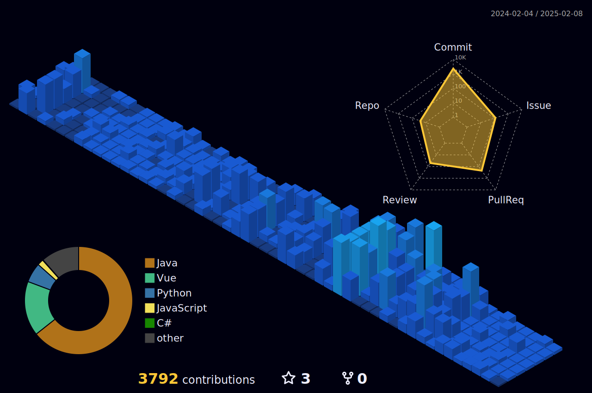

  
 
 
<!-- -->

<h3>I'm currently studying</h3>

<!---->

  

<!-- -->

     

<h3>Experience</h3>
 
멋쟁이 사자처럼 11기 상명대학교(천안) 대표 
  
ssafy ambassador 2023.9.23 ~ 2024.2.28
  
2023 상명대학교 학교 축제 페이지 "비상" BE
  
2024 GSC '철수의 옷장' BE
  
2024 트렌디톤 'Coy' BE  (최우수상)
   

  

